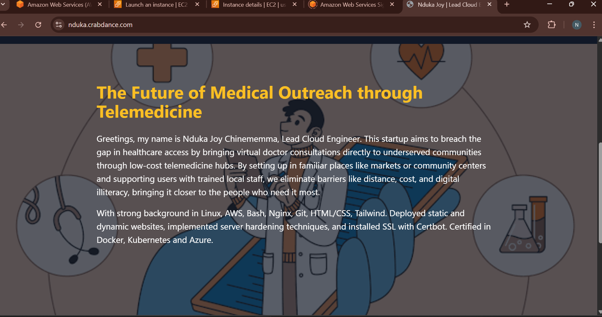
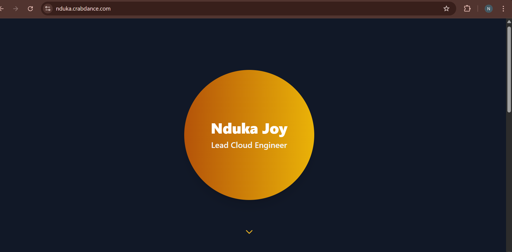

# Altschool Second Semester Exam Project
## Nduka Joy Chinememma -  ALT/SOE/024/5412

My submission for the second semester exam project demonstrates my ability to create a dynamic landing page, provision a server, use AWS, install a Node.js application, configure a reverse proxy with Nginx, and secure the site using Let's Encrypt SSL.
 The final page is hosted at:  
 http://nduka.crabdance.com
## Public IP - 18.212.6.222

## Screenshots

### Landing Page 1  

### Landing Page 2  

## Steps Used to complete project:

I launched an Ubuntu EC2 instance on AWS 22.04 LTS AMI.
Then connected via SSH using a pem key.
I designed the landing page with HTML, CSS and an image.
Installed Node.js and built a simple Express server.
Installed Nginx and set up a reverse proxy to Node.
I configured a custom domain - nduka.crabdance.com.
Secured the domain with Certbot + Let's Encrypt.
Created a custom dynamic HTML landing page.
I allowed inbound HTTP (80) and HTTPS (443). 
Finally, I initialized a git repository and pushed my work to Github

